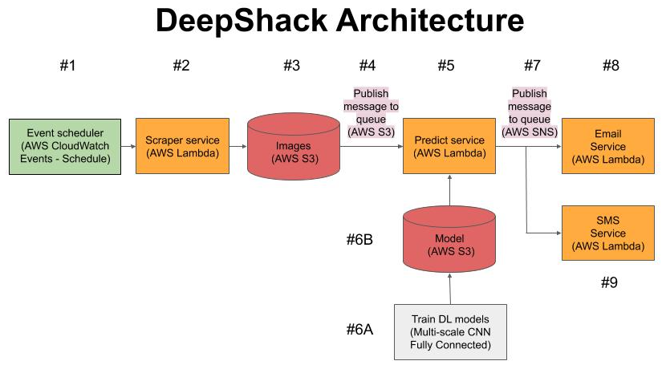

### Visit Shake Shack with the help of Deep Learning!

Description
=============

Shake Shack is lunchtime (and dinnertime) favorite for people in Manhattan.  The original location was opened in July 2004 in Madison Square Park.  Its popularity is such that in the summer the wait in line for service can stretch to over an hour, especially on weekends when the weather is pleasant. A webcam on the restaurant's web page shows the current line in real time in order to inform customers of the length of the line.

So to ease the decision making process on whether to visit Shake Shack at any given time of the day, our service aims to notify subscribers of the number of people in line at the Madison Square Park location though Deep Learning.  Either through an SMS or email, the service aims to notify the subscriber of the number of people waiting in line.

There are two main use cases or the service:

- An email is sent at a user-determined scheduled time(s) during the day with a count of the number people in line.
- A user sends a SMS message to the service, and will receive a count of the number of people in line.

Microservice Architecture
================

</>

There are 4 services which will be implemented on AWS Lambda. This design decouples each service and allows for a serverless architecture.

- AWS Lambda  -- standalone microservices that are triggered by events
- AWS Simple Notification Service (SNS) -- message queue between microservices
- AWS S3 -- Raw data storage for images and models
- AWS CloudWatch -- event scheduler

Special thanks to [Dmitri](https://github.com/dimroc/count/tree/master/ml/data/annotations) for inspiring the machine learning piece and sharing annotated images for training data set.
