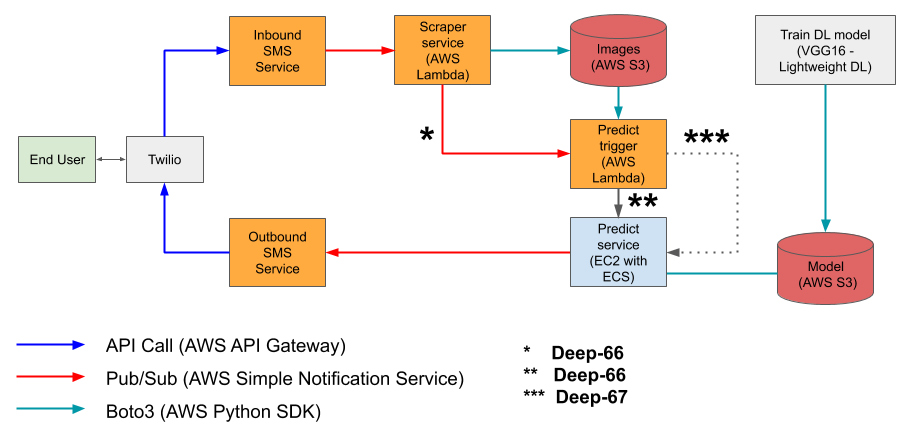

Visit Shake Shack with the help of Deep Learning!

## Description

Shake Shack is lunchtime (and dinnertime) favorite for people in Manhattan.  The original location was opened in July 2004 in Madison Square Park.  Its popularity is such that in the summer the wait in line for service can stretch to over an hour, especially on weekends when the weather is pleasant. A webcam on the restaurant's web page shows the current line in real time in order to inform customers of the length of the line.

So to ease the decision making process on whether to visit Shake Shack at any given time of the day, our service aims to notify subscribers of the number of people in line at the Madison Square Park location though Deep Learning.  Using SMS, a user will send a text message to the service which will notify the user with its best estimate of number of people waiting in line.

## Microservice Architecture

There are 4 services which will be implemented on AWS Lambda as well as other services listed below. This design decouples each service and allows for a serverless architecture.

- AWS Lambda  -- Standalone microservices that are triggered by events.
- AWS Simple Notification Service (SNS) -- Managed pub/sub messaging service between microservices.
- AWS S3 -- Object storage service for images and models.
- AWS ECS -- Container orchestration service that allows the launch of Docker-enabled applications.
- Twilio SMS -- Programmable service that allows for communication with AWS Lambda though an API Gateway.

Special thanks to [Dmitri](https://github.com/dimroc/count/tree/master/ml/data/annotations) for inspiring the machine learning piece and sharing annotated images for training data set.
