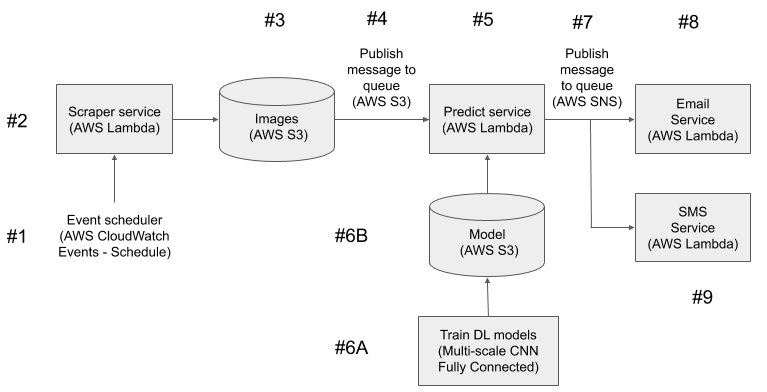

.. image:: images/Deep-Shack.png
	:scale: 50%
	:align: center

================
DeepShack
================
---------------------------------------------------
Visit Shake Shack with the help of Deep Learning!
---------------------------------------------------

Description
=============

Shake Shack is lunchtime (and dinnertime) favorite for people in Manhattan.  The original location was opened in July 2004 in Madison Square Park.  Its popularity is such that in the summer the wait in line for service can stretch to over an hour, especially on weekends when the weather is pleasant. A webcam on the restaurant's web page shows the current line in real time in order to inform customers of the length of the line.

.. image:: images/shakeshack-1500848940.jpg
   :scale: 50%
   :align: center

So to ease the decision making process on whether to visit Shake Shack at any given time of the day, our service aims to notify subscribers of the number of people in line at the Madison Square Park location though Deep Learning.  Either through an SMS or email, the service aims to notify the subscriber of the number of people waiting in line.   

There are two main use cases or the service:

- An email is sent at a user-determined scheduled time(s) during the day with a count of the number people in line.
- A user sends a SMS message to the service, and will receive a count of the number of people in line.

MVP Architecture
================

There are 3 services which will be implemented on AWS Lamba. This design decouples each service and allows for a serverless architecture.

- Scraper Service will send a GET request to the ShackCam and save the image onto an AWS S3 bucket, which creates an event.
- Predict Service will listen to the event and load the model from AWS S3.  It will estimate the actual crowd count using the trained model, then publish a message to AWS SNS (Simple Notification Service).  Using the annotated ShackCam image set, we will fine tune the model utilizing transfer learning method and save the model on S3, which will be used by the Service.
- Email/SMS Service will subscribe to the message and send an email or text with the predicted count.

Project Requirements
====================
* The Service Architecture will satisfy the following requirements.
	- More than one service - We will have a total of 4 services.
	- Inter-service communication - We will use AWS SNS (Sub/Pub Messaging Service) to communicate between Predict and Email/SMS services.
	- We will use github to manage and merge the code base.
	- We will use JIRA to manage tasks.
	- We will use Standups and Retrospectives in order to seek transparency and open collaboration in an effort to discover bottlenecks, resolve issues, focus on flow and continuously improve our process.
* The Service Architecture will contain the following additional features.
	- Train and Use a Model
	- Present Data (Email/SMS)
	- Event Driven Service

Authors and acknowledgment
==========================

Team Members:
E.K. Itoku (iitoku2), Oscar Jasklowski (ovj2101), Phillip Kim (ppk2003), Ivan Ugalde(du2160), Sean Xu (cx2118)

Special thanks to Dmitri (Dimroc) for inspiring the machine learning piece and sharing annotated images for training data set.  

https://blog.dimroc.com/2017/11/19/counting-crowds-and-lines
